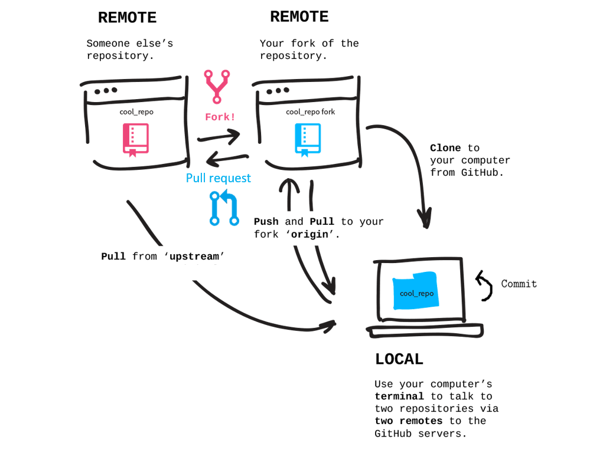
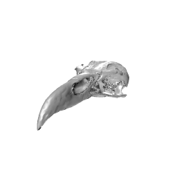

# Collaborative coding with GitHub and RStudio

## About this work
This work was originally created by [Anna Krystalli](https://github.com/annakrystalli) from [RSE-Sheffield](https://github.com/RSE-Sheffield) under a [MIT licence](https://github.com/MalikaIhle/Collaborative-RStudio-GitHub/blob/master/LICENSE), and was subsequently adapted by [Malika Ihle](https://ox.ukrn.org/people/#MalikaIhle) from [Reproducible Research Oxford](https://ox.ukrn.org/), with the contributions of [Adam Kenny](https://github.com/Kennyanthro). The overview image is from [Dumitru Uzun](https://duzun.me/tips/git). The exercice is based on the [research](http://eprints.whiterose.ac.uk/99452/1/Bright%20et%20al.%202016_SelfArchive.pdf) of [Jen Bright](https://twitter.com/MorphobeakGeek) who also kindly provided the gifs used in the exercice. You are free to use, copy, modify, distribute this work for your own projects.

***

## Overview of the exercice

In this session, you will  
* **fork** a GitHub repository (i.e. copy a collaborator's repository to your own GitHub account)    
* **clone** it locally (i.e. copy it to your computer while maintaining a connection to your remote (GitHub) version)    
* create a new file locally and **commit** it to your local repository (i.e. save the file locally in your version control system)  
* **push** your changes to your GitHub version (i.e. synchronise your local changes with your remote repository)  
* contribute a file to the original repository by making a **pull request** (i.e. request your collaborator, the owner of the original repository, to fetch your proposed changes and merge them into the original repository)   
* observe the outcome of all contributions merged by your collaborator   
* **pull the upstream repository into your fork** (i.e. update your fork to reflect all the changes that happened in your collaborator's original repository)  

  
 

In this example, the file you will contribute is required to simulate the evolutionary trajectory of an imaginary bird species’ body size. We will use RStudio and GitHub to collate all species files and plot them all up together at the end. We will also discover the skull and beak shapes associated with each species you contributed (after they 'evolved' through a simple brownian motion  model which assumes steps to progress comletely at random).

***

## Step-by-step tutorial
The material is self-paced and it is necessary that you work through the sections in order.

* [Fork](./fork.md) - Copy your collaborator's repository 
* [Clone](./clone.md) - Copy your repository locally
* [Commit](./commit.md) - Make changes and save them locally
* [Push](./push.md) - Update your remote repository with your local changes
* [Pull request](./pull-request.md) - Ask your collaborator to integrate your changes in their repository
* [Merged results](./merge.md) - Observe the merge of all contributions
* [Pull the upstream repository into your fork](./pull-upstream.md) - Update your fork with all contributions made to the original repository

***
