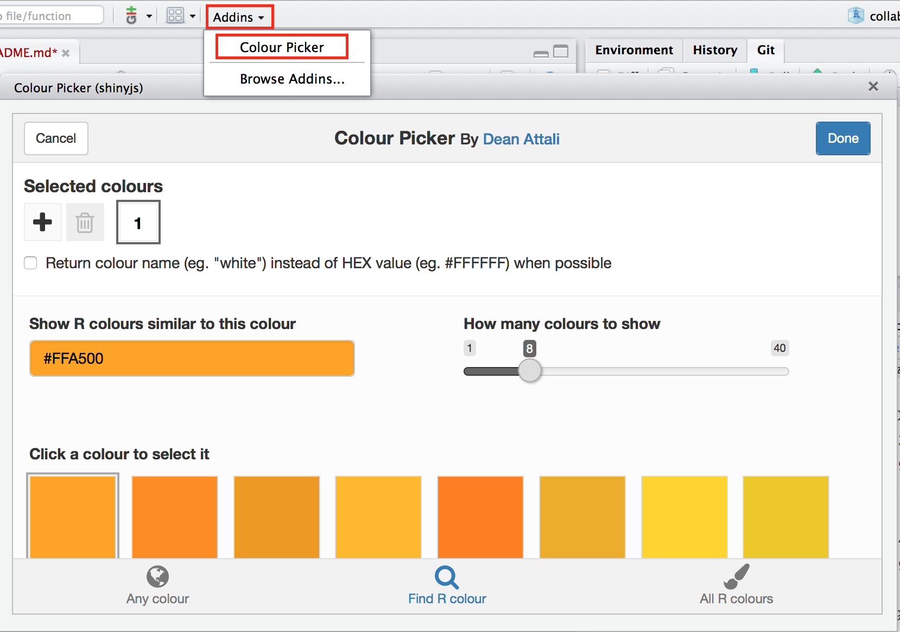

### *collaborative github exercise:*
# **Welcome to the evolutionary lottery of skull and beak morphology**

 

**Beak and skull shapes in birds of prey (“raptors”) are strongly coupled and largely controlled by size.** In this exercise we will use a github repo to collaboratively collate and simulate evolutionary trajectories for each participants' species body size using a simple brownian motion evolutionary model. This assumes evolutionary steps to progress comletely at random. You could say, it's a bit of lottery! 

## **your mission**

- Each participant will **create and contribute a file** specifying the parameters required to simulate and plot their species evolutionary trajectory. 
- We'll collect all participants' files in the master repo. 
- Once all trajectories are simulated they'll be plotted together. 
- Participants will then get to **see the skull and beak shape** corresponding to their species relative body size!

 

### **Next Session: Join Remotely!**
## [**MozFest 2016**](https://mozillafestival.org/): **Saturday, 29 Oct 1:00pm-3:00pm**
#### [**Collaboration through Github and Rstudio**](https://app.mozillafestival.org/#_session-259)

We'll be **accepting pull requests** by remote participants between **2.00 - 3.00 pm**, so anyone can get involved! Follow [**#EvoLottery**](https://twitter.com/search?f=tweets&q=EvoLottery&src=typd) on the day for live updates on twitter.

***

 

# **GO!**
[link to full session handout]()

#### **github:** fork 

- fork the repo into your own account
- copy repo url link local files to github repo 

 

#### **rstudio:** clone locally

- create new project
- checkout from version control/git
- paste github repo link

 

#### **rstudio:** create parameter `.R` script

A template is provided in the repo, in folder `/params` named `params_tmpl.R`. Open the `params_tmpl.R` and **save as** to create a duplicate template. Name the template using the name of your species. 

 

#### **rstudio:** edit your params `.R` script

The parameters each participants need to supply are:

- **`sig2`:** A numeric value greater than 0 but smaller than 5

- **`species.name`:** a character string e.g. `"anas_krystallinus"`. Try to create a species name out of your name!

- **`color`:** e.g. `"red"`, `"#FFFFFF"` (tip: **pick a color using Rstudio's Color picker:**)

 

#### **rstudio:** save and commit the changes

- Use the git tab, tick the box next to your new script and commit. 

- Supply a descriptive message of the commit.

 

#### **rstudio:** push to github
- push your changes to github

 

#### **github:** create pull request
 - create a pull request to merge your changes to the master repo
 
#### **github:** check to see my response to your request
 - most likely it'll be a thumbs up! But I might also request a correction if I spot an error.

 

***
 
### Links to previous evolution lottery sessions:
 
 - [**ISBE Reproducibility Symposium**](Challenge for our generation: open, reproducible and reliable science): [evolutionary lottery](http://rpubs.com/annakrystalli/200121)
 - [**UNAM OpenScience workshop series**](https://annakrystalli.github.io/UNAM/index.html): [evolutionary lottery](http://rpubs.com/annakrystalli/205756)