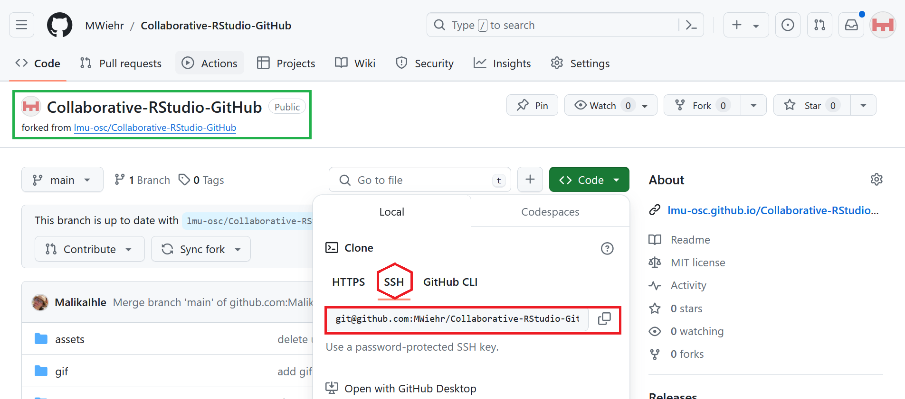
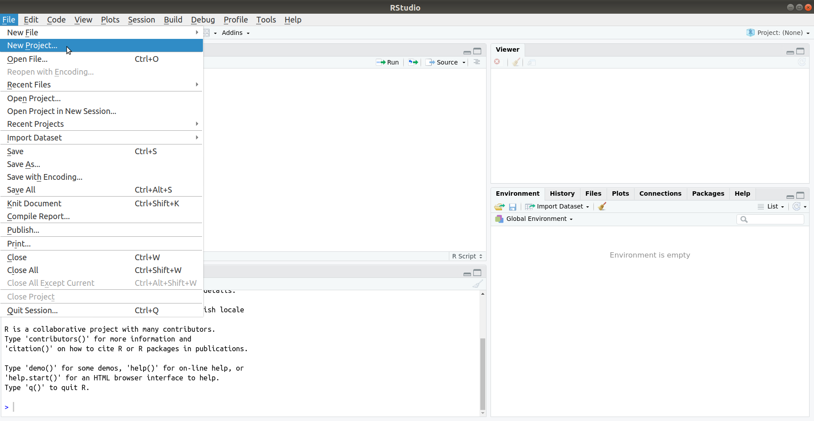
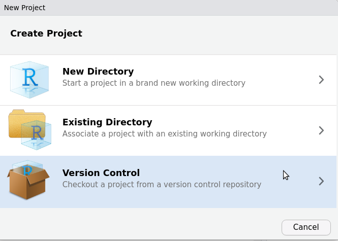
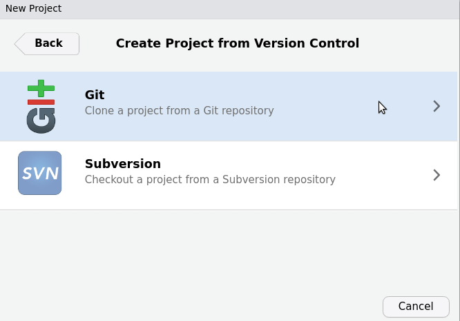
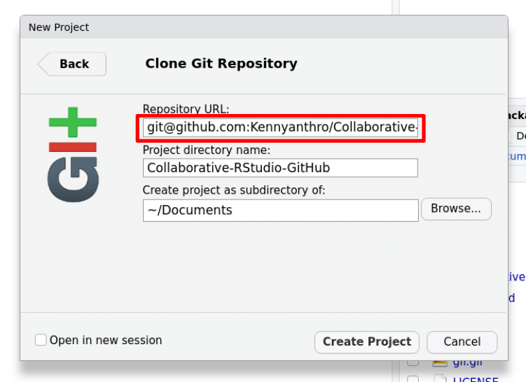
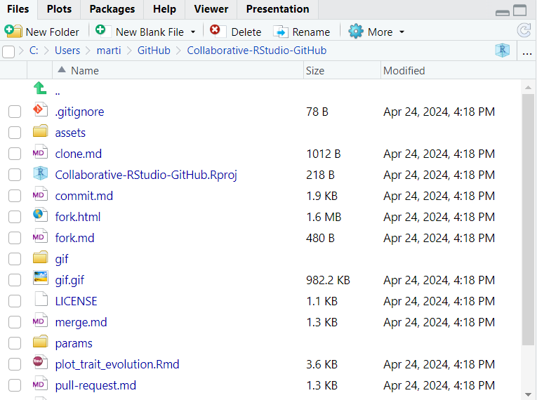

# Clone your GitHub repository

***
1. **GitHub**: click on the green `Code` or `Clone` button and copy **your** repository's URL

2. **RStudio**: create a new project

3. **RStudio**: select `Checkout a project from a version control repository`

4. **RStudio**: select `Clone a project from a Git repository`

5. **RStudio**: paste the URL of **your** GitHub repository into 'Repository URL'. Click `Create Project`

6. **RStudio**: Click on the Files tab to check that it contains all the files from the GitHub repository

***

[Previous](./fork.md) | [Next](./commit.md)
