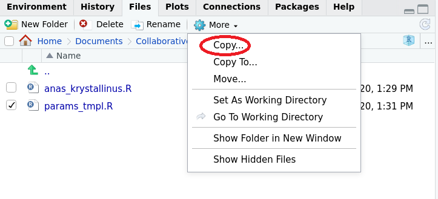
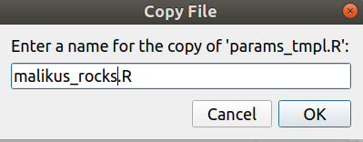
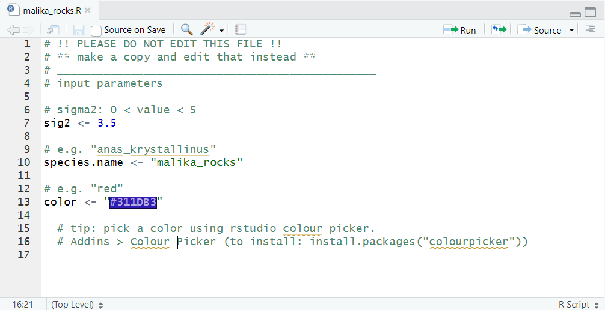
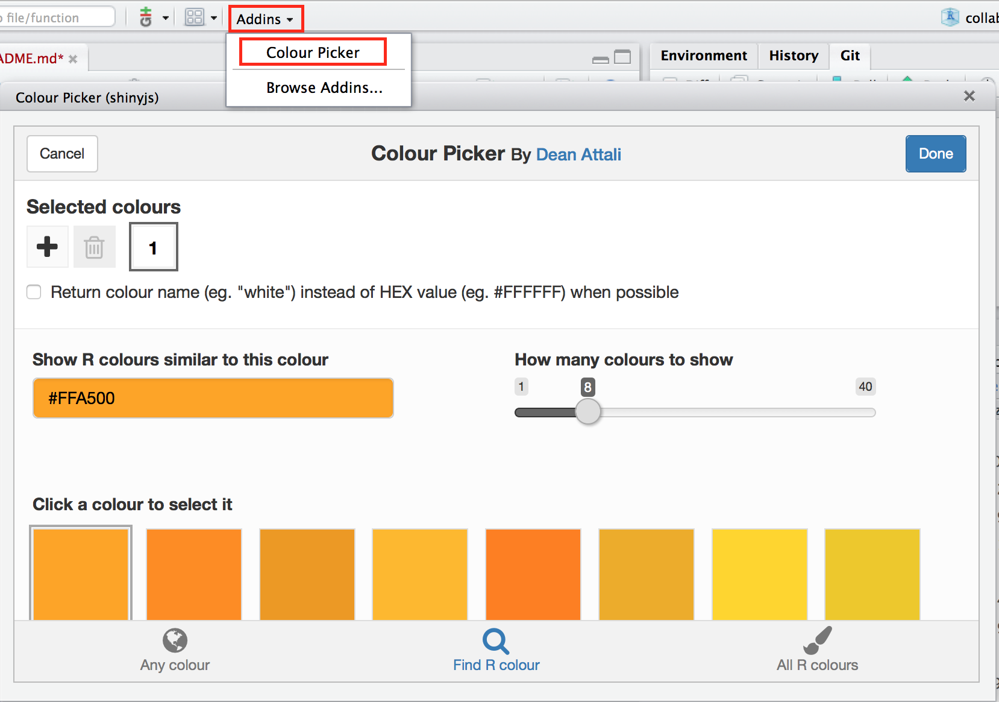
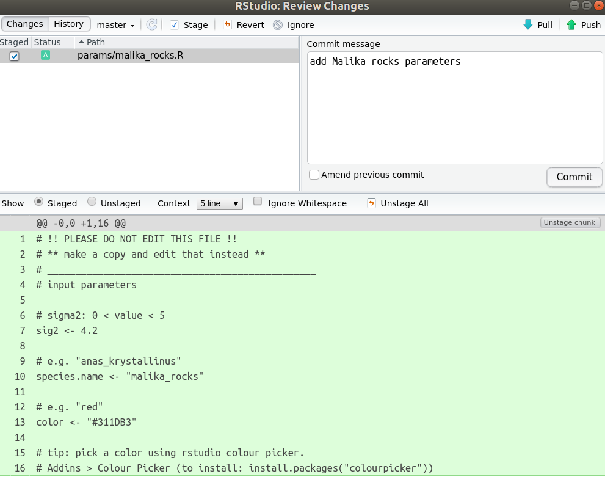

# Commit changes locally

***
To avoid conflict during this collaborative coding exercice (i.e. contributors editing the same line of code at the same time), today, we will work on different files altogether. To avoid conflict in future projects, nothing will be able to replace good communication. If need be, you could still [resolve conflicts using the command line](https://docs.github.com/en/free-pro-team@latest/github/collaborating-with-issues-and-pull-requests/resolving-a-merge-conflict-using-the-command-line). Today, to avoid conlfict, you will copy a template file and edit your own copy.

1. **RStdudio**: select `params/params_tmpl.R` and click  on 'More', 'Copy', and give it the name of your imaginary species. Please to not overwrite or edit the file `params/params_tmpl.R`.

<!--       -->
<!--       -->

2. **RStdudio**: edit your `.R` script

<!--       -->

The parameters each participants need to supply are:

- **`sig2`:** A numeric value greater than 0 but smaller than 5

- **`species.name`:** a character string e.g. `"anas_krystallinus"`. Try to create a species name out of your name!

- **`color`:** e.g. `"red"`, `"#FFFFFF"` (tip: **pick a color using RStudio's colour picker:**)

If you want, you can use the RStudio colour picker to select a color, to install it, type `install.packages("colourpicker")` in your console. 

3. **RStdudio**: save your file and in the git tab, tick the box next to **your new script ONLY** to stage your file and click 'commit'.

<!--       -->

4. **RStdudio**: supply a descriptive message of the commit and click `commit`

<!--       -->

***