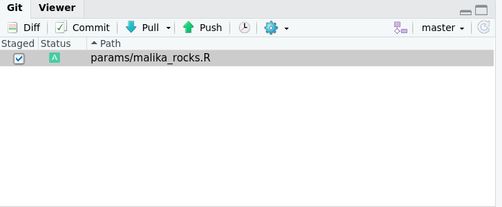

# Commit changes locally

***
To avoid conflict during this collaborative coding exercice (i.e. contributors editing the same line of code at the same time), today, we will work on different files altogether. To avoid conflict in future projects, no tool will be able to replace good communication. However, GitHub offers tools to help that communicaiton, called [GitHub issues](https://guides.github.com/features/issues/). And if need be, you could still [resolve conflicts using the command line](https://docs.github.com/en/free-pro-team@latest/github/collaborating-with-issues-and-pull-requests/resolving-a-merge-conflict-using-the-command-line). Today, to avoid conlfict, you will copy a template file and edit your own copy.

1. **RStudio**: select `params/params_tmpl.R` and click  on 'More', 'Copy', and give it the name of your imaginary species or your name. **Please to not overwrite or edit the file `params/params_tmpl.R`.**

2. **RStudio**: edit your `.R` script

The parameters each participants need to supply are:

- **`sig2`:** A numeric value greater than 0 but smaller than 5

- **`species.name`:** a character string e.g. `"anas_krystallinus"`. Try to create a species name out of your name!

- **`color`:** e.g. `"red"`, `"#FFFFFF"`

(optional) If you want, you can use the RStudio colour picker to select a color. If you don't have it installed, type `install.packages("colourpicker")` in your console. 

3. **RStudio**: save your file and in the Git tab, tick the box next to **your new script ONLY** to stage your file and click 'commit'.

4. **RStudio**: supply a descriptive message of the commit and click `commit`

***

[Previous](./clone.md) | [Next](./push.md)
