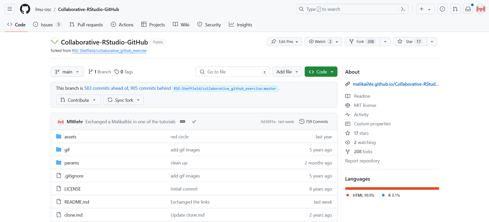
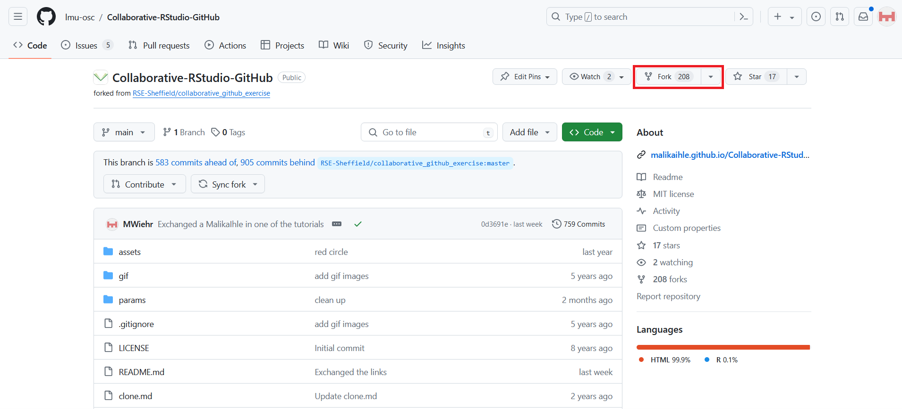
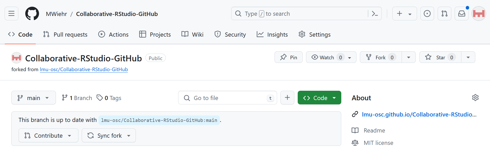

# Fork a GitHub repository

***
1. **GitHub**: go to https://github.com/MalikaIhle/Collaborative-RStudio-GitHub

2. **GitHub**: click on `Fork`. GitHub is creating your own copy of the repository in your GitHub account. Forks are linked and traceable.

***

[Previous](./README.md) | [Next](./clone.md)
