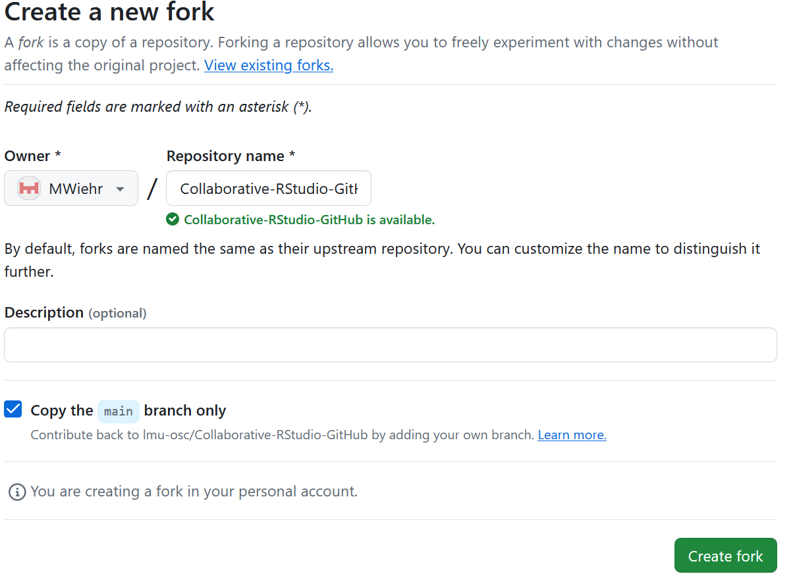

***
1. **GitHub**: go to [https://github.com/lmu-osc/Collaborative-RStudio-GitHub](https://github.com/lmu-osc/Collaborative-RStudio-GitHub).

 

2. **GitHub**: click on `Fork`. GitHub is creating your own copy of the repository in your GitHub account. Forks are linked and traceable.

    
 
 

3. **GitHub**: click on the green button 'create fork' with the default settings.

     
  
   

4. **GitHub**: you should now have a fork of this repository in your own GitHub account.

    
    
 
  
***

