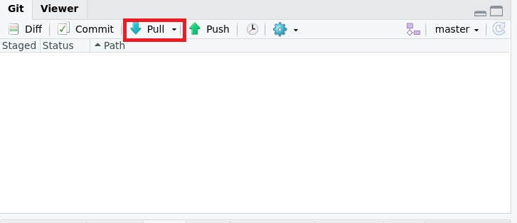
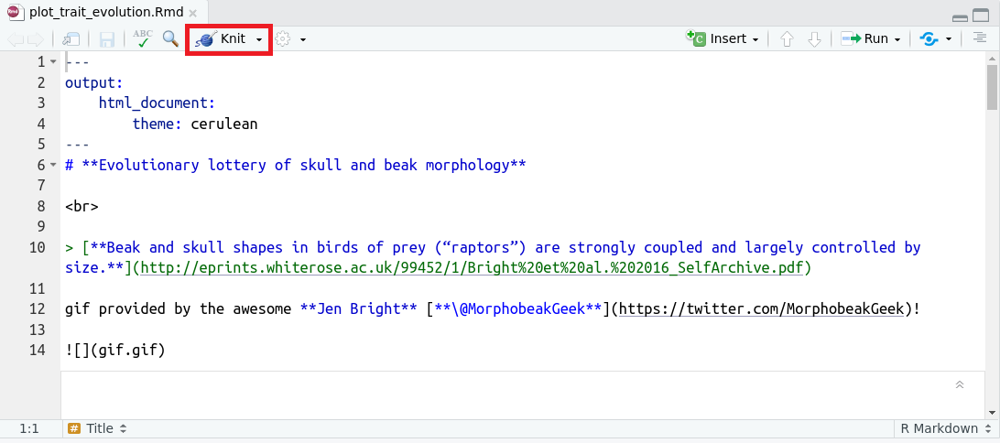
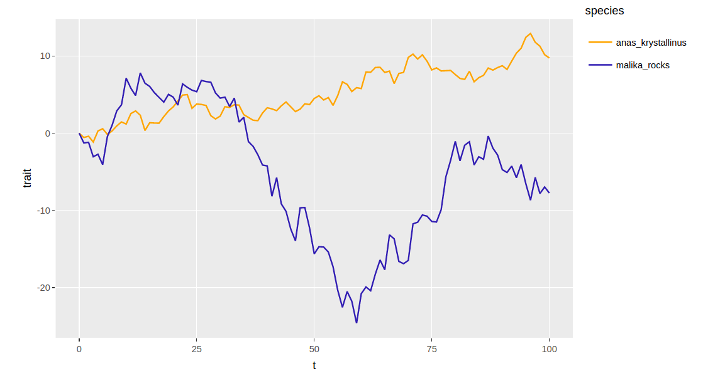
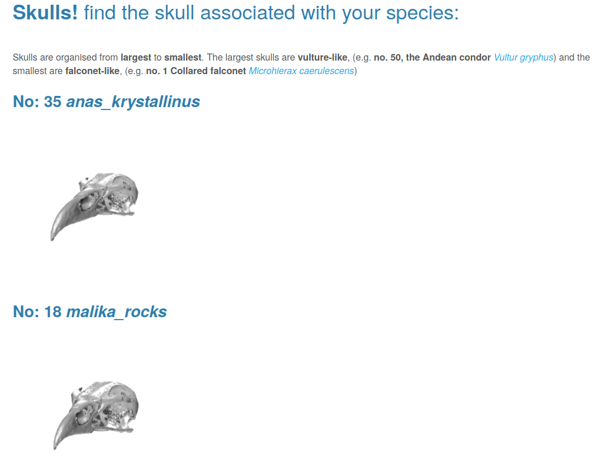

# Observe the merged contributions

***

1. **Collaborator's screen**: Once all parameters are collated, look out for the results on my screen. After accepting your pull requests, I will pull my GitHub repository into my local repository. 

2. **Collaborator's screen**: I will knit the Rmarkdown file `plot-trait-evolution.Rmd` which sources all the contributed files. Knitting a Rmarkdown file means rendering the Rmarkdown code (that integrate R code and Markdown code) into a defined format, here a html file. This file generates plots and figures based on the parameters that were contributed.  

3. **Collaborator's screen**: If all packages needed to run this script and to knit the file into a html page are installed, this file will generate plots and figures based on the parameters that were contributed.

You can see the full result of a previous session [here](https://rpubs.com/annakrystalli/278074).

***

[Previous](./pull-request.md) | [Next](./pull-upstream.md)
