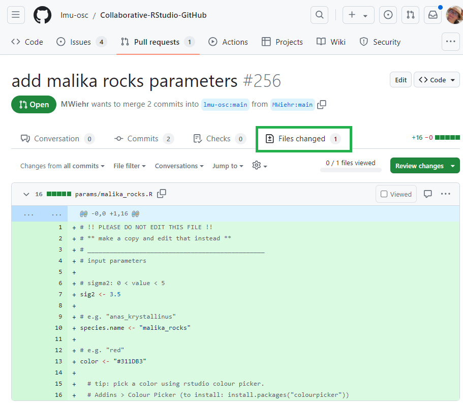
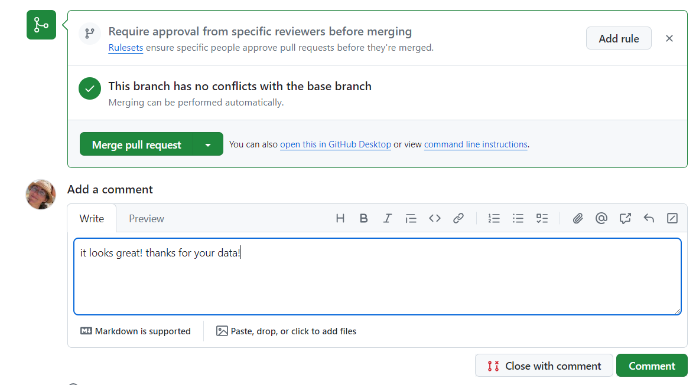

# Observe the merged contributions

***

**!!! If the session is live!!!**: go see your collaborator merge your pull request! Most likely it will be a thumbs up and result in a merge! But your collaborator might also request a correction if they spot an error. 

 

**If you are following this tutorial on your own asynchronously**: These are the steps of the merge: 

 

1. **Collaborator's screen - GitHub**: In their pull request tab, they will inspect the files you changed and ensure that the parameters were inputted correctly so as to not break down their code down the line. 

    

 

2. **Collaborator's screen - GitHub**: They will navigate back to the conversation tab of your pull request to write some comments, merge your pull request, and confirm the merge. 

    

 

3. **Collaborator's screen - RStudio**: They will pull their GitHub repository into their local repository. 

    

 

4. **Collaborator's screen - RStudio**: They will knit the Rmarkdown file `plot-trait-evolution.Rmd` which sources all the contributed files. Knitting a Rmarkdown file means rendering the Rmarkdown code (that integrate R code and Markdown code) into a defined format, here a html file. This file generates plots and figures based on the parameters that were contributed.  

    

 

5. **Collaborator's screen - RStudio**: If all packages needed to run this script and to knit the file into a html page are installed, this file will generate plots and figures based on the parameters that were contributed.

   
   

 

This is how one can integrate data and code to a common repository shared amongst collaborators!

***

[Previous](./pull-request.md) | [Next](./pull-upstream.md)
