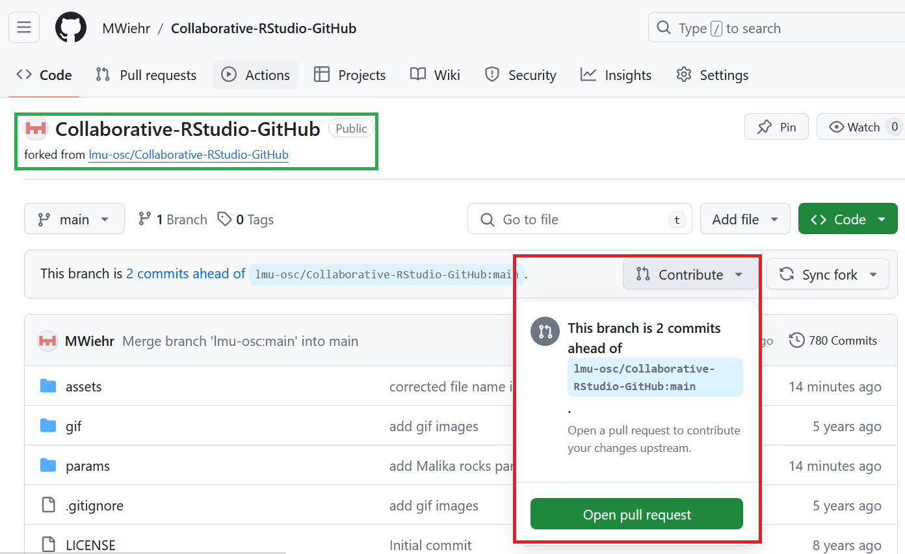

# Create a pull request to ask your collaborator to merge your fork to the original repository

***

1. **GitHub**: in your repository, click on `new pull request` 

2. **GitHub**: make sure the base fork is the original repository and the head fork is yours, both set on their main branch (branches are diverging versions of a file **within** a repository - we will not cover this concept today), and check that your requested merge does not create any conflict. If all is good, click on `Create pull request`

3. **GitHub**: write an informative message, explaining your changes to your collaborator, the author of the original repository. Click on `Create pull request`

4. **GitHub**: check to see your collaborator's response to your request and check the original repository to see your merged changes. Most likely it will be a thumbs up! But your collaborator might also **request a correction** if they spot an error.  

***

[Previous](./push.md) | [Next](./merge.md)
