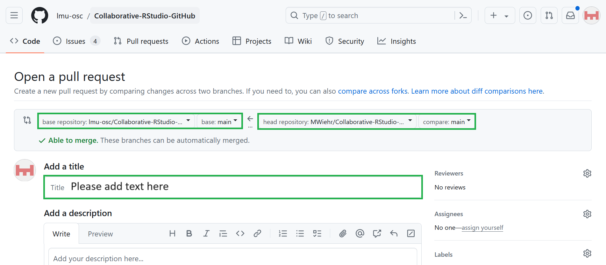

# Create a pull request to ask your collaborator to merge your fork to the original repository

***

1. **GitHub**: in your repository, click on '**contribute**' and '**open pull request**' 

    

 

2. **GitHub**: **make sure the base repository is the LMU Open Science Center's original one and the head fork is yours**, both set on their main branch (these repositories should only have one branch anyway called 'main'. Branches are diverging versions of a file *within* a repository - we will not cover this concept today). Check that your requested merge does not create any conflict. In addition, **write an informative message**, explaining your changes to your collaborator, the author of the original repository. Click on `Create pull request`

    

 

3. **GitHub**: you can now see a conversation tab around your pull request in the repository of the original owner: 

    

***

