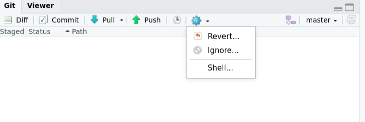
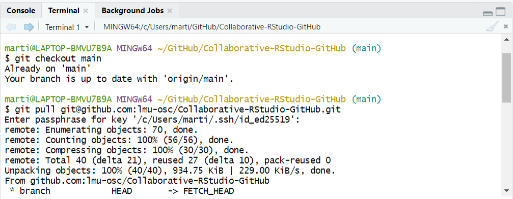
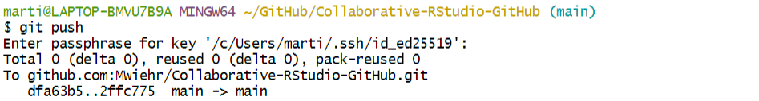

# Pull upstream repository into your fork

***

To integrate all the contributions made to the original repository into your local repository, you may think that you could first integrate the changes from the original repository into your fork (your GitHub version) and then pull your fork (to update your local copy), but this is not possible. You will need to shortcut this by pulling the original repository into your local repository directly (and then push the local new changes to your remote version on GitHub). This means that this operation needs to happen locally, in RStudio. Because you will not be pulling from your fork (your remote GitHub) but from the original repository, and that this isn't a daily operation, you do not have a shortcut for this in RStudio. This operation needs to be instructed in the command line, which can be easily summoned from RStudio.

1. **RStudio**: in the Git tab, click on 'More' and 'Shell' (or go to 'Tools' and 'Shell'). This opens the shell directly in your repository.

2. **Shell**: in the command line, you will first make sure you are on the branch you wish to receive the modifications (today we didn't create branches, and the default branch is called 'master' (historically) or 'main' (as part of the company's effort to remove unnecessary references to slavery)). Type  
`git checkout DEFAULT_BRANCH_NAME`

3. **Shell**: type the command to pull the original repository and branch you wish to obtain locally  
`git pull https://github.com/ORIGINAL_OWNER/ORIGINAL_REPOSITORY.git BRANCH_NAME`

4. **RStudio**: check in the Files tab that the new contributions appeared.

5. **RStudio**: push those local changes to your GitHub repository

You are done!

***

[Previous](./merge.md) | [Home](./README.md)
