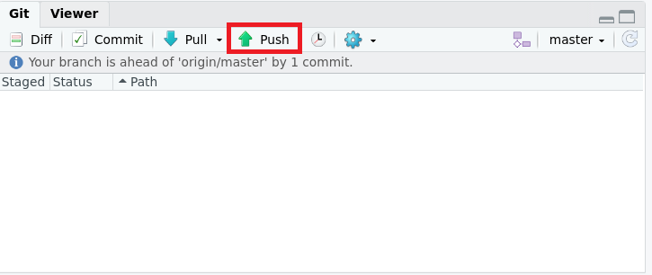
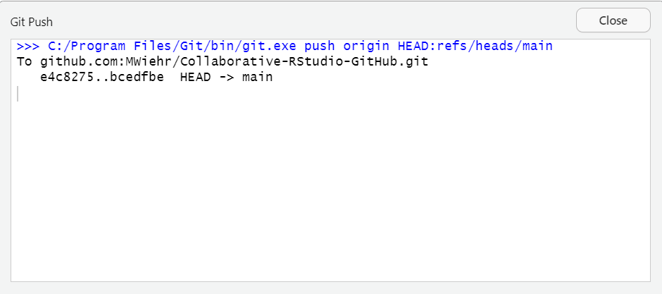

# Push your local changes to your remote repository

***

1. **RStdudio**: push your changes to github by clicking the green arrow up in the git tab.

<!--       -->

2. **GitHub**: verify your changes are visible in your GitHub repository

<!--       -->

***